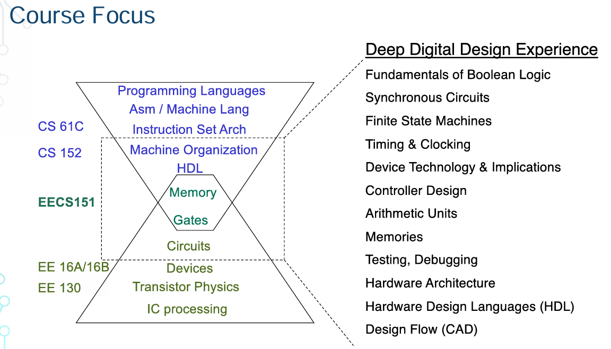
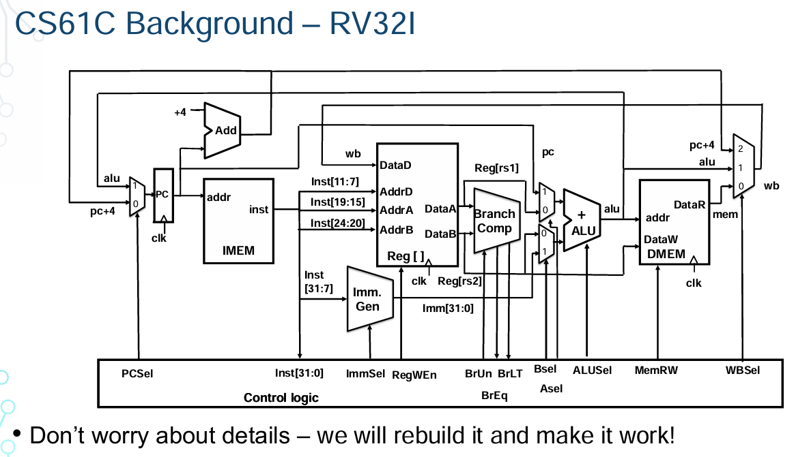
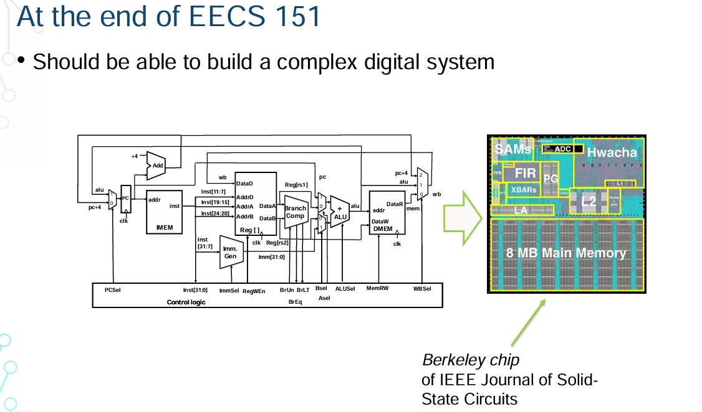
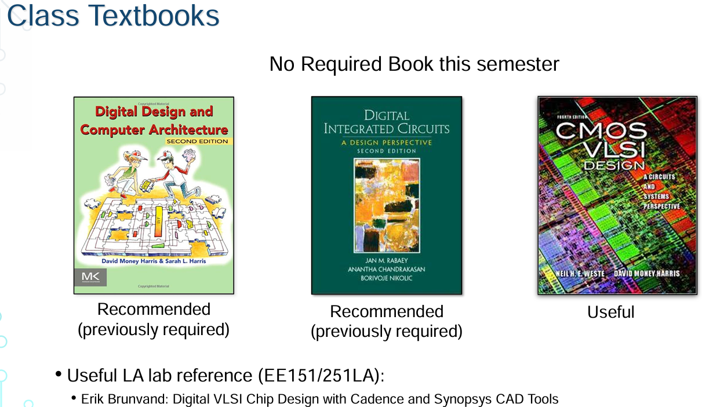

# Introduction to Digital Deisgn and Integrated Circuits

[EECS 151/251A, Spring 2022](https://web.archive.org/web/20230221140014/https://inst.eecs.berkeley.edu/~eecs151/sp22/index.html)

# 数字设计与集成电路导论

## 课程目标与内容

这门课的目标是让大家对硬件设计产生兴趣，会构建和实现复杂的系统。我们会深入讨论数字逻辑和集成电路原理，学会如何构建复杂的系统。

课程不仅仅是学习概念和做作业，更重要的是通过实验室课程学习不同层次的抽象。现代硬件非常复杂，需要管理不同层次的抽象，利用各种工具来提高性能、功能和效率。这门课的一大部分内容是实验室课程，大家会在这里进行大量的调试和实现，这是学习的重要过程。

我们强调通过实践学习，大家会在实验室中调试和解决问题，最终能够实现一个功能完整的芯片。这是一个非常重要的过程，通过动手实践可以学到很多。

### 课程重点

这门课是为既有计算机科学背景又有电气工程背景的学生设计的。如果你有计算机科学背景，你可能学过编程语言和计算机体系结构，这门课会帮助你深入了解硬件实现。如果你有电气工程背景，你可能已经了解了晶体管的工作原理，这门课会让你了解如何利用这些晶体管构建逻辑门，进而构建复杂的处理器或系统芯片。

### 课程交叉

这门课位于硬件和软件的交叉点，希望通过这门课将电气工程和计算机科学的学生聚集在一起，因为构建一个处理器需要不同领域的知识和技能。这门课的目的是帮助大家在硬件和软件的交叉点上学到更多知识，并最终能够构建出复杂的系统。

> 这门课是为既有计算机科学背景又有电气工程背景的学生设计的。图中展示了课程内容和课程交叉的具体细节：
>
> - **计算机科学背景 (CS 61C, CS 152)**:
>   - 编程语言
>   - 汇编语言/机器语言
>   - 指令集架构
>   - 计算机组织
>   - 硬件描述语言 (HDL)
>
> - **电气工程背景 (EE 16A/16B, EE 130)**:
>   - 电路
>   - 设备
>   - 晶体管物理
>   - 集成电路工艺
>
> - **课程交叉点 (EECS151)**:
>   - 内存
>   - 逻辑门
>   - 电路
>
> ### 深度数字设计体验
>
> 这门课程将提供深度的数字设计体验，涵盖以下内容：
>
> 1. **布尔逻辑基础**:
>    - 学习布尔代数的基本原理，理解逻辑运算和逻辑门的工作机制。
>
> 2. **同步电路**:
>    - 了解同步电路的设计原理，包括时钟信号的生成和使用，确保电路在正确的时间点执行操作。
>
> 3. **有限状态机**:
>    - 掌握有限状态机的设计与实现，理解状态转换和状态保持的机制。
>
> 4. **时序与时钟**:
>    - 学习时钟的概念和重要性，掌握时钟周期、时序分析和时钟分配的方法。
>
> 5. **设备技术及其影响**:
>    - 探讨不同半导体设备技术的特点和应用，理解它们对电路设计和性能的影响。
>
> 6. **控制器设计**:
>    - 设计和实现各种控制器，理解控制器在系统中的作用和重要性。
>
> 7. **算术单元**:
>    - 设计和优化算术逻辑单元（ALU），掌握加法器、减法器和乘法器等基本组件的工作原理。
>
> 8. **内存**:
>    - 理解内存的构造和工作原理，学习不同类型内存的设计和应用。
>
> 9. **测试与调试**:
>    - 学习硬件设计中的测试和调试方法，掌握如何检测和修复设计中的错误。
>
> 10. **硬件架构**:
>     - 探讨硬件架构的设计原则和方法，理解不同架构对性能和能效的影响。
>
> 11. **硬件描述语言 (HDL)**:
>     - 学习使用硬件描述语言进行电路设计和仿真，掌握Verilog等HDL的语法和应用。
>
> 12. **设计流程 (CAD)**:
>     - 理解计算机辅助设计（CAD）工具在硬件设计中的作用，学习如何使用这些工具进行电路设计和优化。
>
> 课程中会涉及从设备级别到系统级别的多个抽象层次。通过这种方式，学生不仅能学习到各个层次的技术细节，还能理解整体系统的设计和实现方法。这种多层次的学习方法有助于培养全面的硬件设计能力。

---

## 课程背景顺序目标

如果你有 61C 的背景，这会为 151 课程提供完美的基础。61C 中已经学习了如何用 C 语言和 RISC-V 进行编程，以及布尔逻辑，现在这门课将把这些知识应用到硬件中。我们将使用硬件描述语言，而不是在 Logisim 中构建处理器，你们将学习如何在 FPGA 或 ASIC 中实现硬件。

### 课程差异

关于151 和 251 的区别。其实这是一个联合课程，大部分同学是 151 的，但也有 251A 的同学。两者的讲座内容相同，涵盖相同的话题，但作业和期中考试有所不同。251 的作业和考试题目会更难，251 的同学还需要在实验中实现更多功能。

### 课程大纲和作业

关于课程大纲、作业发布和截止时间，所有这些内容都将提前公布。我们稍后会详细讨论课程的各个部分和大致的日程安排。

### 课程顺序

很多同学问应该先修 151 还是 152，其实两者都可以。151 更侧重硬件实现，而 152 更关注架构原理。如果你对电路设计感兴趣，E140 也是一门很好的课，这门课主要涉及数字逻辑，而不涉及模拟组件。

### 先修课程 61C

61C 是这门课的重要先修课程，很多同学已经在 61C 课程中实现了 RISC-V 处理器。在这门课中，我们会增加很多细节，并在硬件中实现这些设计，无论是 FPGA 还是 ASIC。具备 61C 背景会帮助你更好地理解这门课的内容。

### 课程的最终目标

这门课将为你准备构建一个相当复杂的数字系统，许多 151 的学生也参与了我们的 Silicon 实验课程，这门课每年春季开设，学生可以体验到真正的芯片设计和制造过程。这些技能在工业界非常受欢迎，很多公司都在寻找具有强硬件设计经验的学生。

---

## 课程组织

### 讲座

正如之前提到的，这是一门非常复杂的课程，因为我们既要涵盖硬件软件设计的原理，还要给你们实际动手实践的机会。我们每周二和周四有两次讲座，主要内容是硬件数字逻辑和集成电路的不同设计和细节。

### 讨论课

### 作业

9 个作业基本上每周一个，每个作业的完成时间大约为一周，答案会在下一周公布。

### 实验课

实验课是这门课的一个非常重要的部分。请确保你注册了 FPGA 实验课或 ASIC 实验课。实验课的重点是设计 RISC-V 处理器，这是一个非常有趣且具有挑战性的项目。

### 期中和期末考试

### Piazza 和 GitHub

课程的很多信息都会在 Piazza 和 GitHub 上发布。实验课的具体时间和安排也会在这些平台上公布。如果需要更换实验课时间，是可以的，我们会根据具体情况增加实验课的时间。

### 作业评分

作业将按照准确性评分，不会很难，主要是帮助大家复习课程内容。如果你参加了讲座和讨论课，作业应该不会有太大问题。

### 教材

这门课没有指定的教材，只要认真学习讲义内容就足够了。一些可选的阅读材料，但不是必需的。

### 讨论课的重要性

讨论课非常重要，可以与助教直接互动，复习讲座中的重要内容，解决作业和考试中的问题，巩固所学知识。建议大家积极参与讨论课。

### 弹性政策

7天的作业宽限期和14天的实验课宽限期。如果有紧急情况，可以灵活使用这些宽限期。

### FPGA 和 ASIC 实验课的区别

FPGA 实验课每个学生会拿到一个 FPGA 板，直接在板上编程和调试。ASIC 实验课更接近于实际的芯片制造过程，从仿真、综合、布线到最终的硅片原型设计。尽管两者的核心原理相同，但平台有所不同。

通过这些组件的设置，希望大家不仅能学到理论知识，还能有实际的动手体验。希望这学期大家能有所收获。

---

# Digital Integrated Circuits  and Systems Past, Present and Future

## 半导体行业的崛起与影响

### 半导体行业的重要性

半导体行业是一个充满活力和创新的领域，它在许多方面改变了我们的社会格局。特别是在当前的数字时代，半导体技术在各个领域都发挥着关键作用。互联网、计算机和处理器的进步极大地推动了我们的生活和工作方式，使得全球连接变得更加紧密和高效。

### 硬件设计的复杂性

现代硬件设计不仅仅是创建物理设备本身。随着计算需求的不断增加，我们需要设计能够运行各种应用程序的硬件。这些应用程序从大型云计算数据中心到边缘计算，再到我们日常使用的手机和笔记本电脑，范围广泛且多样。除了通用处理器之外，我们还需要开发特定领域的硬件，以便有效地运行新兴的应用程序。这些特定领域的硬件包括图形处理单元（GPU）、专用加速器和嵌入式系统等。

### 计算设备的演变

传统上，当我们想到计算设备时，通常会想到笔记本电脑或台式电脑。然而，现代计算设备的范围远不止于此。如今的数据中心和智能手机都配备了高度复杂的系统级芯片（SoC），这些芯片整合了多种处理器和功能模块。现代SoC包含高性能和高能效的CPU、GPU、专用加速器以及各种互连和集成技术。这些复杂的组件和技术的结合，使得我们能够使用强大的计算设备来处理复杂的任务和应用，从而推动了技术的进步和社会的发展。

### 半导体技术的广泛应用

半导体技术的进步不仅限于消费电子产品。它在医疗设备、汽车电子、工业自动化、通信设备等领域同样扮演着至关重要的角色。例如，现代医疗设备依赖高精度的半导体传感器和处理器来进行实时数据处理和诊断；汽车中的高级驾驶辅助系统（ADAS）和自动驾驶技术也依赖于强大的半导体芯片来实现复杂的计算和控制功能。

通过不断的技术创新和设计优化，半导体行业正在引领全球技术的发展方向，为各行各业提供坚实的技术基础和无限的可能性。

## 半导体行业的历史和发展

### 早期的半导体发展

半导体行业的历史相对较短，大约在六七十年前，第一个晶体管被发明。晶体管的发明标志着现代电子时代的开始。随后，随着技术的进步，我们开始将多个晶体管集成到一个芯片上，构建出更复杂的系统，这就是集成电路（IC）。集成电路的发明和发展极大地推动了计算机和电子设备的进步，使得设备变得更小、更快、更强大。

### 摩尔定律

摩尔定律由英特尔联合创始人戈登·摩尔在1965年提出，他预测每单位面积内的处理器复杂度（即晶体管的数量）大约每两年会翻一倍。摩尔定律不仅描述了晶体管密度的增加，还反映了成本的降低趋势。通过提高制造工艺和技术，我们能够以相同的价格制造更多的晶体管，从而构建出更复杂、更高效的处理器。

### 摩尔定律的挑战

尽管晶体管密度在过去几十年中一直在增加，但最近几年，增长速度有所放缓，同时成本显著增加。这主要是因为更小的晶体管需要更高的研发投入和更复杂的制造工艺。例如，从45纳米技术节点到更先进的7纳米和5纳米技术节点，制造成本显著增加，技术挑战也越来越大。

## 半导体行业的经济学

### 成本增加的原因

半导体行业成本增加的原因不仅仅是因为缺乏竞争，还因为先进节点的研发和制造复杂度的增加。随着技术节点的缩小，制造工艺变得更加复杂，需要更多的研发投入和更高精度的制造设备。许多公司无法负担这些高昂的成本，导致在最先进技术节点上的竞争减少。虽然在较旧的技术节点（如28纳米和45纳米）仍有许多公司参与竞争，但在更先进的节点上，只有少数几家公司具备足够的资源和能力进行设计和制造。

### 全球化和成本摊销

全球化使得大公司能够更好地摊销成本。通过在全球范围内销售产品，大公司可以将研发和制造的高成本分摊到更多的销售中。然而，在最先进的技术节点上，主要问题在于设计和制造的复杂性，而不是竞争的缺乏。较旧的技术节点仍然有许多公司参与竞争，激烈的市场竞争有助于降低这些节点的成本。

总体而言，半导体行业的经济学反映了技术进步和市场动态之间的复杂关系。尽管面临着成本增加和技术挑战，半导体行业仍在不断创新，推动着全球技术的发展。

 

> 这里的“节点”指的是半导体制造中的制程技术。制程技术通常以纳米为单位表示，比如7纳米、10纳米、14纳米等。每一个制程节点都代表着晶体管的尺寸不断缩小，能够在同样的芯片面积内容纳更多的晶体管，从而提升性能和能效。
>
> 具体来说，制程技术节点的进步意味着：
>
> 1. **晶体管密度增加**：更小的晶体管意味着可以在同样的面积内放置更多的晶体管，这会带来更高的性能和更低的功耗。
> 2. **性能提升**：更小的晶体管通常能够以更高的速度运行，因为电流路径变短。
> 3. **能效提高**：更小的晶体管在相同的电压下消耗的功率更少，有助于降低整体功耗。
>
> 然而，随着技术节点的不断缩小，制造工艺的复杂性和成本也显著增加。先进的制程技术需要更精细的制造设备、更复杂的设计规则和更多的研发投入。这些挑战使得只有少数几家公司能够继续推进最先进的制程技术。
>
> 所以，在讨论半导体行业时，技术节点或制程技术是一个非常关键的概念，直接影响到芯片的性能、成本和能效。

---

## 性能与功耗的平衡

### 摩尔定律和 Dennard 缩放定律

摩尔定律告诉我们如何在每单位面积内塞进更多的晶体管，从而提升处理器的性能。然而，功耗也是一个必须考虑的重要因素。Dennard 缩放定律在其开创性工作中指出，通过缩小晶体管的尺寸，不仅可以提升性能，还可以在不增加功耗的情况下实现更高的处理器性能和效率。Dennard 缩放定律的核心思想是，随着晶体管尺寸的缩小，电压和电流也会相应减少，从而保持功耗密度恒定。这使得处理器能够在更高的频率下运行而不增加功耗。

### 过去的增长

在过去的几十年里，我们的处理器确实在跨代中变得越来越快，晶体管数量增加，频率提高，且成本基本不变。这种趋势使得消费者可以每隔几年升级计算机、手机等设备，享受更高的性能。摩尔定律和 Dennard 缩放定律的结合使得这种性能增长和成本降低成为可能。

### 现状与挑战

然而，最近几年你可能注意到，即使购买了新处理器，频率也基本保持不变。现在的新特性更多体现在核心数量的增加、更强大的 GPU、以及专门的神经引擎等方面。这是因为 Dennard 缩放定律在现代工艺节点上不再适用。随着晶体管尺寸的进一步缩小，我们无法在保持相同功耗密度的情况下继续提高频率。这意味着增加处理器频率会导致功耗和散热问题变得无法控制。

### 设计中的约束与优化

硬件设计不仅是关于有趣的创意，还涉及在各种约束条件下实现这些创意。设计约束包括功耗预算、面积预算和性能目标。硬件设计是一个复杂的优化问题，需要在不同的约束条件下找到最佳的解决方案。例如，设计师需要在性能、功耗和芯片面积之间进行权衡。有时，为了提高性能，设计师可能需要增加功耗；而在其他情况下，为了降低功耗，可能需要牺牲一些性能。

### 频率和功耗的变化趋势

过去，晶体管数量持续增长，但频率和功耗的提升却停滞了。为了应对这一挑战，现代处理器主要通过增加核心数量和引入特定功能来提升性能。例如，图形处理单元（GPU）和深度学习专用处理器（如神经引擎）都被集成到处理器中，以处理特定类型的任务。这些专用处理器不仅提高了性能，还提升了能效，因为它们针对特定任务进行了优化。

### 功耗与性能的权衡

在这门课中，我们将深入讨论功耗与性能的权衡。这是硬件设计中非常重要的一个方面。设计师需要在设计过程中不断权衡不同的因素，找到最佳的解决方案。例如，在设计高性能处理器时，如何在满足功耗限制的同时最大化性能？如何在有限的芯片面积内集成更多的功能？这些都是设计师需要考虑的问题。

---

## 成本分析

### 制造成本与非经常性工程成本

我们之前讨论了设计和制造成本，特别是随着技术节点的进步，制造成本显著增加。然而，除了制造成本之外，还有一种称为“非经常性工程成本”（Non-Recurring Engineering Costs, NRE）的成本。NRE成本包括了软件开发成本、验证成本和设计成本等。这些成本是一次性的，但对于整个项目的预算影响重大。

### 软件成本

随着处理器核心数量的增加，并行计算的问题和机会也随之而来。为了充分利用多核处理器，必须编写并行程序，而不是传统的顺序程序。这需要更多的编程工作和系统软件开发，使得软件成本显著增加。特定领域计算（如加速器）的发展也需要相应的软件支持，以便程序员能够高效地利用这些加速器。例如，图形处理器（GPU）需要专门的图形驱动和并行计算框架（如CUDA或OpenCL），而神经网络加速器则需要专门的深度学习库和框架（如TensorFlow或PyTorch）的支持。

### 验证成本

现代处理器不仅包含单一的CPU，还包含多种异构组件，如GPU、加速器、神经引擎、共享缓存和总线。这些组件都需要进行严格的验证，以确保它们的功能和性能达到预期。验证过程包括功能验证、性能验证和可靠性验证等，随着系统复杂性的增加，验证成本也随之上升。验证成本不仅包括硬件验证，还包括软件模拟和实际测试。

### 设计成本

现代处理器的设计不仅包括CPU，还包括GPU、加速器和其他IP模块（Intellectual Property Modules）。这需要更多的硬件和软件设计人员，以及系统固件设计人员来完成这些设计。这些设计成本在半导体业务中占据了重要位置。设计团队需要具备多学科的知识，包括电路设计、系统架构、软件开发和测试验证等。

> ### IP模块（Intellectual Property Module）
>
> IP模块，即知识产权模块，是指在半导体设计中使用的预先设计和验证过的功能块或组件。这些模块可以是各种不同类型的功能单元，例如处理器核、存储器控制器、接口控制器、加速器等。IP模块通常由第三方公司或半导体公司内部设计和提供，目的是提高设计效率、降低开发成本和减少设计风险。
>
> ### IP模块的类型
>
> 1. **处理器核**：
>    - 包括各种类型的CPU核，如ARM Cortex-A系列、RISC-V核等。处理器核是系统的核心计算单元，执行指令和处理数据。
>
> 2. **存储器控制器**：
>    - 控制与各种类型存储器（如DRAM、SRAM、闪存）之间的数据传输。存储器控制器IP模块可以优化存储器访问的性能和功耗。
>
> 3. **接口控制器**：
>    - 包括各种通信接口，如PCIe、USB、Ethernet、SATA等。接口控制器IP模块实现与外部设备或其他芯片的高速数据通信。
>
> 4. **加速器**：
>    - 专用于特定任务的硬件单元，如图形处理单元（GPU）、神经网络加速器（NPU）、加密解密单元等。加速器IP模块通过硬件加速特定任务，提高性能和效率。
>
> 5. **模拟/混合信号IP**：
>    - 包括模数转换器（ADC）、数模转换器（DAC）、时钟生成器等。这些模块在信号处理和系统时钟管理中发挥关键作用。
>
> ### IP模块的优点
>
> 1. **提高设计效率**：
>    - 使用预先设计和验证的IP模块，可以大大减少开发时间，使设计团队能够更快地完成项目。
>
> 2. **降低开发成本**：
>    - 重用现有的IP模块可以降低研发成本，避免从头开始设计所有组件的费用和时间。
>
> 3. **减少设计风险**：
>    - 经过验证的IP模块可靠性高，能够减少设计中的错误和风险，提高最终产品的稳定性和性能。
>
> 4. **促进标准化**：
>    - IP模块通常遵循行业标准，使用这些模块有助于确保系统的兼容性和可扩展性。
>
> ### IP模块的应用
>
> 在现代半导体设计中，IP模块广泛应用于各种复杂的系统级芯片（SoC）中。通过组合和集成多个IP模块，设计师能够构建出具有丰富功能和高性能的芯片。例如，在智能手机的SoC中，可能包含CPU核、GPU、存储器控制器、各种通信接口以及专用的多媒体处理单元。这些IP模块的组合使得智能手机能够执行各种复杂的任务，如图形渲染、数据处理、无线通信等。
>
> 总结来说，IP模块是半导体设计中不可或缺的组成部分，通过使用IP模块，设计团队可以更高效地构建复杂的硬件系统，同时降低开发成本和风险。

## 抽象层次与设计复杂性

### 抽象层次的管理

硬件设计涉及多个抽象层次，从低层次的晶体管和逻辑门优化到高层次的系统架构设计。设计过程需要在不同的抽象层次之间进行切换，以便有效地管理设计和验证的复杂性。例如，在设计初期，可能需要关注高层次的系统架构和功能模块的分解；在设计中期，需要关注逻辑门级别的优化和电路设计；在设计后期，需要关注晶体管级别的优化和物理布局。

### EDA 工具的应用

现代硬件设计越来越依赖电子设计自动化（EDA）工具，通过硬件描述语言（HDL）或编译器驱动的方式进行设计。EDA工具可以大大提高设计效率和质量，使设计过程更加系统化和自动化。例如，使用Verilog或VHDL进行电路描述，通过综合工具生成门级电路，通过布局布线工具进行物理实现，通过仿真工具进行功能验证。

### 设计中的权衡

在设计过程中，需要在性能、功耗和面积之间进行权衡。例如，为了提高性能，可能需要增加功耗；为了减少面积，可能需要牺牲部分性能。这种权衡需要在设计的各个阶段进行优化和调整。例如，在架构设计阶段，需要选择合适的处理器架构和指令集；在电路设计阶段，需要优化逻辑门级电路以平衡速度和功耗；在物理设计阶段，需要进行布局布线优化以减少面积和互连延迟。

---

## 设计抽象与层次结构

### 设计层次

设计抽象不仅涉及具体的设计内容，还涉及不同的设计层次。我们已经讨论了整个系统的设计、不同的I/O接口、处理器及其模块、逻辑门和电路，甚至是底层的器件本身。这门课程将涵盖所有这些层次。你可能会有时感到迷失，这是正常现象，因为我们将涉及许多不同的细节和复杂的概念。

### 不同层次的转换

课程中会在不同的设计层次之间不断转换。有时我们会深入到晶体管级别，讨论它们的工作原理和优化；有时我们会讨论更高层次的系统架构和模块设计。我会告诉你当前我们所处的设计层次，以帮助你更好地理解我们正在讨论的内容和其上下文。

### 模块化设计

设计复杂系统的一个关键策略是“分而治之”，将大型处理器或系统分解为多个较小的组件，并在每个组件上发展足够的技术专长。理解和掌握各个层次的细节对于成功设计复杂系统至关重要。这种方法不仅有助于管理复杂性，还可以提高设计的可维护性和扩展性。

## 数字设计课程的核心

### 权衡与优化

硬件设计的核心是理解并在性能、成本和能效之间做出权衡。你需要在各种约束条件下设计出既具创造性又复杂的系统，使其能够高效地执行各种功能和任务。这包括在设计过程中不断进行优化，以找到性能、功耗和面积之间的最佳平衡。

### 实验工具

课程中使用的实验工具与我们在研究和工业界中使用的工具相同。这些工具非常重要，因为现代硬件设计非常复杂，需要借助这些工具来构建和验证大型系统。在实验中使用这些工具的经验将对你的未来职业发展非常有用。例如，使用电子设计自动化（EDA）工具可以显著提高设计效率和质量，使你能够更快地完成复杂设计。

### 创造性的过程

硬件设计不仅是一个技术性的过程，它也是一种艺术形式。硬件设计师在设计中可以展现个人的创造力和独特性。尽管最终的设计目标可能相同，但每个人的设计都会有所不同，因为每个人都有独特的设计风格和思维方式。这种创造性使得硬件设计成为一个充满乐趣和挑战的领域，你可以通过自己的设计给产品注入个性和创新。

### 课程总结

这门课非常有趣，充满了激动人心的机会和实践性。我们期待与大家一起探索这个有趣的领域，并希望大家在这个过程中能够激发对硬件设计的兴趣。期待在整个学期中与你们一同学习和成长。

---

## 数字设计：它到底是什么？

### 目标

在数字设计中，我们的目标是根据功能描述以及性能、成本和功耗的约束条件，使用一组基本单元（如逻辑门、触发器等）创建一个实现方案。这需要我们理解和应用基本单元，并将它们组合起来，以实现所需的功能。

### 学习过程

1. **了解基本单元及其使用方法**：
   我们首先需要学习基本的数字电路组件，如逻辑门、触发器和寄存器等，理解它们的工作原理和应用场景。

2. **学习设计表示方法**：
   我们需要掌握如何表示和描述设计，包括电路图、时序图和状态机等。这些表示方法帮助我们更好地理解和分析设计。

3. **学习形式化方法和工具**：
   使用形式化的方法和工具来操作这些表示方法。例如，使用硬件描述语言（HDL）如Verilog或VHDL来描述电路，通过综合工具将这些描述转换为实际的电路实现。

4. **研究设计实例**：
   通过研究和分析现有的设计实例，我们可以学习到实际设计中的经验和技巧。这些实例可以帮助我们更好地理解设计过程中的挑战和解决方案。

5. **尝试与错误 - CAD工具和原型设计**：
   实践是学习数字设计的重要部分。通过使用计算机辅助设计（CAD）工具进行设计和原型制作，我们可以在实际操作中发现和解决问题，不断提高自己的设计能力。

### 数字设计的艺术性

数字设计既是一门科学，也是一门艺术。创造性在于如何将基本单元和其他组件以新的方式组合在一起，以实现所需的功能。在设计过程中，我们需要不断地进行创新和试验，找到最佳的解决方案。

然而，与艺术不同的是，数字设计有客观的衡量标准：性能、成本和功耗。通过这些衡量标准，我们可以评估和优化设计，确保其达到预期的目标。
