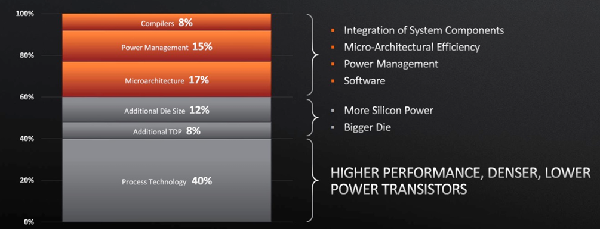
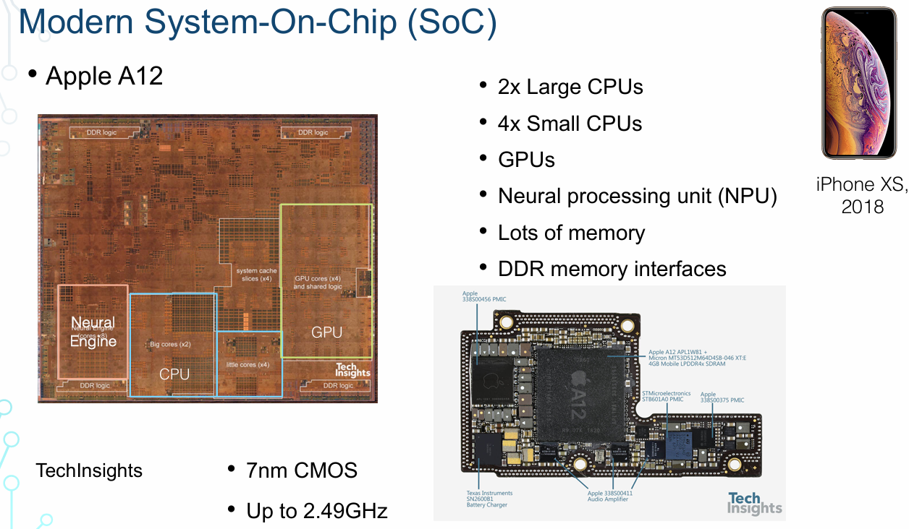
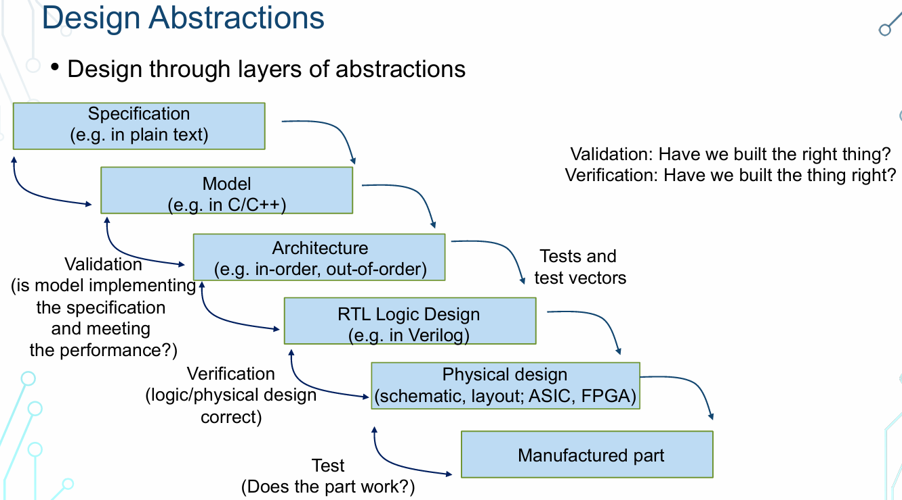

# L02. Design Abstraction

# 设计抽象

## 引言

这是几年前 AMD 分享的一段非常有趣的数据，讨论了不同类型的硬件和软件创新对性能提升的影响。当我们思考硬件和软件设计时，特别是硬件设计，我们通常会谈论技术的演变、微架构和电路设计。然而，实际上每个组件都对最终的整体性能有着重要影响。

### 技术演进

底层技术（如制造工艺）的进步在性能提升中起着核心作用。这是摩尔定律为何如此重要的原因之一。每一代新技术都能大幅提升性能和效率，这一直是半导体行业性能提升的主要驱动力，直到大约十年前。然而，随着时间的推移，技术创新变得越来越困难和昂贵。

### 微架构

微架构设计是硬件设计中至关重要的一部分。在过去的四到五十年中，微架构的改进推动了许多性能提升。随着底层技术的发展速度放缓，我们期望更多的性能提升来自微架构的优化。微架构创新包括流水线深度的增加、分支预测的改进和缓存结构的优化等。

### 电源管理

电源管理在提高能源效率方面扮演着关键角色。通过高效的电源管理，我们可以显著提升系统的端到端性能。这包括动态电压和频率调整（DVFS）、电源闸控和休眠模式等技术，使得系统在不同负载下能耗最优化。

### 编译器

编译器的优化对系统性能的影响不容忽视。尽管我们主要讨论硬件，但编译器是将软件转换为硬件能理解的指令的关键工具。高效的编译器优化能够充分利用硬件资源，提升整体系统性能。例如，编译器的循环展开、内联和指令调度等优化技术，都能显著提高程序的执行效率。

### 定制化硬件的优势

定制化硬件（如专用加速器或 FPGA）针对特定应用进行了优化，这使得它们在特定应用领域（如机器学习）表现出色。这类硬件可以在特定任务中提供极高的性能和能效。然而，这种优势通常是以通用性为代价的。相比之下，通用处理器能够适应广泛的应用需求，而专用加速器则在其设计的特定应用中表现卓越。

### 技术进步的局限性

关于制造工艺的极限问题，很多人都在问：我们是否会最终无法使晶体管变得更小？这是半导体行业面临的一个重大挑战。尽管每年都有预测称技术进步即将终结，但我们仍然看到许多创新。例如，在改进制造工艺方面，仍有许多令人兴奋的研究正在进行。然而，过去十年里，获得显著性能提升变得更加困难和昂贵。尽管新设备性能有所提升，但用户体验到的提升却变得越来越小。

总结来说，硬件和软件的协同创新对于提升系统性能至关重要。尽管技术进步面临挑战，我们仍需不断探索和创新，以实现性能和效率的持续提升。

---

## 今日主题概述

今天的主题主要集中在设计抽象的概念上。我们将讨论什么是抽象，以及如何通过不同层次的抽象进行设计和实现。我们还将探讨什么是数字系统，以及如何构建数字系统。尽管这些概念对一些人来说可能已经很熟悉，但我们会深入探讨这些内容，特别是在学期的后半部分。

在面对复杂问题或设计一个系统时，直接从头到尾考虑每个细节会令人困惑不堪。以系统级芯片（SoC）为例，如果我们从晶体管层次开始思考，那么需要处理数十亿个晶体管，这几乎是不可能完成的任务。因此，我们采用了一种被称为“抽象层次”的方法来简化设计过程。

## 设计抽象现代SoC示例

让我们以现代智能手机中的系统级芯片（SoC）为例。以下是2018年发布的苹果iPhone XS 中的A12 SoC。SoC是一个高度复杂的系统，集成了多种组件，使得硬件变得更加专业化和异构化。

### CPU与多核处理器

在这个SoC中，我们有多个处理器内核（CPU），其中包括大内核和小内核。大内核是高性能处理器，具备更多并行处理能力和更大的缓存，因此能够更快地运行任务。而小内核则是能效处理器，适用于简单任务，提高效率。例如，当手机处于空闲状态时，小内核可以处理简单任务，以节省能量。

### GPU与图像处理

此外，SoC还包含图形处理单元（GPU），用于图像和视频的压缩、解压和处理。现代移动处理器中的GPU非常强大，能够提供流畅的视频和图片体验，支持复杂的图形计算和游戏应用。

### 神经引擎与机器学习

随着机器学习在移动处理器中的重要性与日俱增，现代SoC中通常包含专门用于机器学习处理的神经引擎。这些神经引擎优化了机器学习任务的处理效率，可以快速执行图像识别、语音处理和其他人工智能任务。

### 内存结构

内存在SoC中占据了重要位置。如果你查看芯片的照片，会看到许多非常规则的结构，这些就是内存，用于数据的存储和传输。因为从芯片外部获取数据代价高昂，所以我们在芯片内部分配了大量内存，以提高数据访问速度和能效。

## 复杂系统的管理

抽象层是硬件设计中的关键概念。通过将设计分解为多个抽象层，我们可以更有效地管理复杂性。例如，在硬件设计中，我们可以有逻辑门级别的抽象、寄存器传输级别的抽象、系统级别的抽象等。每一层抽象都简化了上一层的复杂性，使设计过程更加可控。

### 逻辑门级别的抽象

在这个层次上，我们关注的是基本的逻辑运算和电路设计。这包括设计和优化基本的逻辑门（如与门、或门、非门）以及它们的组合电路。

### 寄存器传输级别的抽象

在这个层次上，我们关注的是数据在寄存器之间的传输和操作。设计师在这一层次上定义了数据路径和控制信号，以确保数据在不同模块之间正确传输和处理。

### 系统级别的抽象

在最高层次上，我们考虑的是整个系统的架构设计和模块划分。设计师需要定义系统的各个子系统如何协同工作，包括处理器、存储器、I/O接口等。

## 设计过程中的抽象

设计过程中的抽象层次的方法从高层次的理解开始，然后逐步深入到更低层次。这种方法有助于我们逐步明确每个需要构建、制造和测试的组件。测试在设计中至关重要，因为它确保了最终设计符合预期。

### 1. 规格说明

设计的第一步是确定系统的规格说明。这一步类似于软件项目中的需求分析，是指导设计的基础。例如，假设我们想要构建下一代处理器，它需要比上一代快10%，支持所有现有程序，同时增加两条新指令。这些指令对于未来的应用程序非常重要。规格说明通常包括以下内容：

- 系统的功能需求
- 目标应用程序
- 面积预算
- 支持和不支持的功能

通过明确规格说明，我们为设计过程设定了明确的目标和限制条件。

### 2. 行为建模

接下来，我们需要一种方式来模拟硬件的行为。行为建模是用来表示硬件行为的程序，以便在实际构建硬件之前验证我们的规格说明是否合理。例如，我们可以通过模拟来评估提高10%性能的目标是否可行。行为建模有助于减少设计复杂性，并在构建硬件之前提供定量反馈，从而确保设计决策的合理性。

### 3. 架构设计

在架构设计阶段，我们详细确定处理器的设计和各个模块。例如，我们可能决定通过增加一个特殊的整数单元来提高性能。架构设计包括详细描述每个模块及其相互作用。这一阶段比之前的抽象层次更具体，涉及到模块的功能划分和接口定义。

### 4. 实现阶段

在实现阶段，我们使用硬件描述语言（如Verilog或VHDL）来描述硬件的具体实现。这类似于编写软件程序，但这里的程序是用于描述硬件功能的。我们详细描述每个模块的逻辑和操作，以实现之前设计的架构。这一步骤需要将高层次的架构设计转化为低层次的逻辑实现。

### 5. 硬件实现

最后一步是将设计好的硬件描述转化为实际硬件。这包括使用ASIC（专用集成电路）或FPGA（现场可编程门阵列）来实现设计。在这一阶段，我们通过物理实现来验证和测试设计的实际性能。这一步骤是设计的最终阶段，确保设计能够在实际硬件上正常运行。

## 验证与验证的重要性

在每个抽象层次上，我们都需要进行验证和验证，以确保设计的正确性。验证（Verification）和确认（Validation）是硬件设计流程中非常重要的一部分。验证类似于软件中的测试，确保设计按照预期工作，发现并修复错误和缺陷。虽然本课程不详细讨论验证过程，但理解其重要性对于成功的硬件设计至关重要。

通过采用抽象层次的方法，逐步细化设计和验证过程，我们可以有效地管理复杂性，确保最终设计的高质量和可靠性。

---

## 使用 RISC-V 设计作为例子

好的，如果不用普通的例子，那就让我们以 RISC-V 设计为例子。当你开始你的最终项目，甚至可能是在此之前，你会阅读详细的规格说明文档，这是非常重要的。这份文档通常是一份文本文档，可能会有超过 200 页，有些内容可能会相当冗长，但它们基本上详细说明了硬件的行为和构建硬件所需的一切。

### 规格说明文档

规格说明文档中包含了预期的硬件行为，它是设计过程的起点。以 RISC-V 处理器为例，我们会查阅不同的模型，因为有多种不同的模型可供选择，它们的设计基础也不尽相同。例如，Gen Five 是一个非常流行的模型，在硬件设计中经常被使用，而 FireSim 则是由伯克利开发的，基于 FPGA 的仿真平台，也是我们经常使用的工具之一。这些模型帮助我们验证和测试我们的设计想法，确保它们与我们的预期一致。

### 架构设计

在架构设计阶段，我们决定处理器的详细设计和模块。每个设计师都有自己的风格和偏好，比如如何划分流水线阶段，如何提取并行性等等。这是设计的微架构，也是你在本课程中设计自己处理器时需要关注的内容之一。

### 硬件描述语言

接下来是硬件描述阶段，我们会使用硬件描述语言（如 Verilog）来描述我们的设计。Verilog 是一种常用的硬件描述语言，在本课程中我们会深入学习它。当然，还有其他的硬件描述语言，比如 SystemVerilog 和 Tresol，在欧洲和伯克利这里也非常流行。选择一种熟悉的硬件描述语言后，你就可以像编程语言一样开始描述硬件的功能和行为。

### 物理设计

最终，我们将进行物理设计，这可能涉及到制造 ASIC 或使用 FPGA 进行仿真和验证。这一步是将我们的设计变为实际硬件的关键阶段。

通过这样层层深入的设计过程，我们能够管理复杂性，并确保我们的硬件设计符合预期。在接下来的课程中，我们将通过具体的案例和实例深入探讨每个设计阶段的细节和实际应用。

### 继续讲解硬件设计的流程和工具使用

好的，让我们继续深入讨论硬件设计的流程和工具使用，特别是在不同的仿真器之间的区别。

### 综合与仿真

在我们的设计过程中，当我们到达 RTL（寄存器传输级）设计和物理设计阶段时，我们将涉及到两个关键的步骤：综合和仿真。

- **仿真（Simulation）**：在开始综合之前，我们通常会进行仿真，确保设计在逻辑层面上是正确的。仿真是通过模拟电路的行为来验证设计的功能和正确性。我们会使用仿真工具来运行测试程序，以确保硬件的逻辑行为符合预期。

- **综合（Synthesis）**：综合是将我们在 RTL 中描述的硬件逻辑转换为实际的物理门电路。这个过程有点类似于编译器将高级语言转换为机器代码的过程。在综合过程中，我们将逻辑电路映射到 CMOS 逻辑门级别，生成可以在实际硅片上实现的电路布局。

### 物理设计：布局与布线

一旦我们完成了综合，我们就进入了物理设计阶段，主要涉及到布局（Placement）和布线（Routing）：

- **布局（Placement）**：布局阶段涉及将逻辑门和电路元件放置在硅片上的不同位置。这类似于建筑设计中的平面布局，我们需要将各个组件合理地安置在硅片上，以确保电路能够高效地工作。

- **布线（Routing）**：布线阶段则是将这些逻辑门之间的连接线路进行规划和设计。这相当于建筑设计中的电气布线，确保信号可以有效地传输，避免干扰和延迟。

### 工具使用和职业发展

在本课程中，我们将学习如何使用这些工具来完成硬件设计的整个流程。这些工具不仅仅是在课堂中使用的，它们也是工业界实际应用的标准工具。因此，通过学习这些工具，你将为未来在硬件设计领域的职业发展打下坚实的基础。

### 课程和实验的关系

实验和课堂内容是紧密相关的，实验将帮助你将理论知识转化为实际操作能力。一旦实验开始，你会发现这些概念变得更加具体和实用，从而加深对设计抽象层次的理解和应用。

### 不同仿真器的比较

针对你的问题，关于不同仿真器之间的区别，这涉及到它们在执行仿真和综合过程中的特性和性能。不同的仿真器可能有不同的优化算法和支持的硬件描述语言的细节，这些可以影响到设计的验证速度和准确性。在实际工作中，你可能会选择适合特定项目需求和团队工作流的仿真工具。

### 结论

总之，硬件设计涉及到层层深入的抽象和具体化过程，通过有效地使用仿真器和综合工具，我们能够确保设计从概念到实际硅片上的顺利实现。随着课程的深入，你将逐步掌握这些关键工具和技能，为未来的硬件设计工作做好准备。

有没有其他问题或者想要分享的想法呢？

当然，请看以下重新组织和扩展后的内容：

---

### 设计抽象与数字系统构建

我们主要讨论设计抽象，接下来我们将深入探讨数字系统的实际构建，包括RTL设计和硬件描述语言Verilog，这些内容将在下周的课程中详细讲解。这些主题实质上描述了我们在系统设计中的具体步骤和技术选择。

### 数字逻辑设计概述

这门课程的重点是数字逻辑设计，与模拟电路设计有所不同。数字系统具有高度的确定性，它们基于一组明确的布尔方程实现功能。我们接收输入数据，通过一系列计算步骤，在数字逻辑模块中完成处理。本学期我们将逐步深入，从简单的逻辑层次一直到晶体管级别的底层实现。

### 数字逻辑模块的内部结构

数字逻辑模块类似于乐高积木系统，其中每个逻辑门就像是乐高积木，实现了基本的逻辑功能。通过组合这些逻辑门，我们能够实现复杂的系统功能，例如现代处理器、机器学习加速器以及图形处理单元（GPU）。这种分层的抽象方法使得我们能够逐步深入理解数字系统的复杂性。

### 逻辑门和布尔代数

在数字逻辑设计中，我们使用各种逻辑门，如与门、或门和非门，这些门基于布尔代数实现特定的逻辑功能。布尔代数提供了一种理解和表达逻辑功能的形式，可以通过符号、布尔方程式或者真值表来描述逻辑运算的结果。

### CMOS技术中的反相器

在CMOS技术中，反相器常用于实现逻辑功能的反相操作。由于其使用简单、成本低廉，反相器在数字逻辑设计中得到广泛应用，例如与门和或门的构建中。

### 不同的逻辑表示方式

我们可以使用布尔方程、符号或真值表来描述逻辑功能，这些方法都能准确地表达同一逻辑运算。这种多样性的表达方式帮助我们更好地理解和分析数字系统中的逻辑运算。

### 总结与展望

数字逻辑设计的核心在于其清晰的逻辑结构和确定性的功能实现。通过将复杂系统分解为简单的逻辑门，我们能够逐步理解和实现现代技术中广泛应用的各种功能模块。

这些内容涵盖了数字逻辑设计的基本概念和进阶内容，希望对你在学习和实践中有所帮助！

### 实现数字系统

- 数字系统通过实现一组布尔方程来运行。

#### 图示说明：
1. **输入（Inputs）**：系统接收的输入信号。
2. **数字逻辑块（Digital Logic Block）**：用于处理输入信号并进行逻辑运算的核心模块。
3. **输出（Outputs）**：处理后的输出信号。

---

### 逻辑门（来源于CS61C/EE16B课程）

- 逻辑门的功能：

#### 单输入逻辑门：
1. **非门（NOT or Inverter）**：
   - **布尔方程**：Out = \( \overline{A} \)
   - **符号**：
   - **真值表**：
     | A    | Out  |
     | ---- | ---- |
     | 0    | 1    |
     | 1    | 0    |

2. **缓冲器（Buffer）**：
   - **布尔方程**：Out = A
   - **符号**：
   - **真值表**：
     | A    | Out  |
     | ---- | ---- |
     | 0    | 0    |
     | 1    | 1    |

#### 多输入逻辑门：
1. **与非门（NAND）**：
   - **布尔方程**：Out = \( \overline{A \cdot B} \)
   - **符号**：
   - **真值表**：
     | A    | B    | Out  |
     | ---- | ---- | ---- |
     | 0    | 0    | 1    |
     | 0    | 1    | 1    |
     | 1    | 0    | 1    |
     | 1    | 1    | 0    |

2. **或非门（NOR）**：
   - **布尔方程**：Out = \( \overline{A + B} \)
   - **符号**：
   - **真值表**：
     | A    | B    | Out  |
     | ---- | ---- | ---- |
     | 0    | 0    | 1    |
     | 0    | 1    | 0    |
     | 1    | 0    | 0    |
     | 1    | 1    | 0    |

#### CMOS门电路
- CMOS门电路始终具有反相特性。

以上内容展示了数字逻辑设计中的基本概念和逻辑门的具体实现方式。通过这些逻辑门，我们可以构建各种复杂的数字系统。

### 逻辑门（Logic Gates）

在数字逻辑设计中，逻辑门是基本的构建单元，每个逻辑门都实现了一种基本的布尔运算。以下是一些常见的逻辑门及其实现方式：

#### 与门（AND Gate）
- **布尔方程**：Out = \( A \cdot B \)
- **符号**：
  
- **真值表**：
  | A    | B    | Out  |
  | ---- | ---- | ---- |
  | 0    | 0    | 0    |
  | 0    | 1    | 0    |
  | 1    | 0    | 0    |
  | 1    | 1    | 1    |
- **CMOS实现**：
  在CMOS技术中，通过与非门（NAND）和反相器（Inverter）的组合实现与门功能。

#### 或门（OR Gate）
- **布尔方程**：Out = \( A + B \)
- **符号**：
  
- **真值表**：
  | A    | B    | Out  |
  | ---- | ---- | ---- |
  | 0    | 0    | 0    |
  | 0    | 1    | 1    |
  | 1    | 0    | 1    |
  | 1    | 1    | 1    |
- **CMOS实现**：
  在CMOS技术中，通过或非门（NOR）和反相器（Inverter）的组合实现或门功能。

### 更多逻辑门（More Logic Gates）

#### 异或门（Exclusive OR Gate, XOR）
- **布尔方程**：Out = \( A \oplus B \)
- **符号**：
  
- **真值表**：
  | A    | B    | Out  |
  | ---- | ---- | ---- |
  | 0    | 0    | 0    |
  | 0    | 1    | 1    |
  | 1    | 0    | 1    |
  | 1    | 1    | 0    |

#### 同或门（Exclusive NOR Gate, XNOR）
- **布尔方程**：Out = \( \overline{A \oplus B} \)
- **符号**：
  
- **真值表**：
  | A    | B    | Out  |
  | ---- | ---- | ---- |
  | 0    | 0    | 1    |
  | 0    | 1    | 0    |
  | 1    | 0    | 0    |
  | 1    | 1    | 1    |

### 补充讲解

#### CMOS技术中的逻辑门实现
CMOS（互补金属氧化物半导体）技术是现代集成电路设计中的主要技术之一。它具有低功耗、高噪声容限和高密度集成等优点。在CMOS技术中，逻辑门通常通过组合基本的PMOS和NMOS晶体管来实现。以与门（AND Gate）为例，它可以通过一个与非门（NAND Gate）加上一个反相器（Inverter）来实现，这样的组合方式可以减少功耗并提高速度。

#### 布尔代数与逻辑电路设计
布尔代数为逻辑电路设计提供了理论基础。通过布尔代数，我们可以用数学的方法来简化逻辑表达式，从而优化电路设计。这种优化可以减少电路的复杂度，提高运行效率，降低成本。

#### 逻辑门的组合
通过组合不同的逻辑门，我们可以实现更复杂的逻辑功能。比如，通过组合多个与门（AND）、或门（OR）和非门（NOT），可以实现加法器、乘法器等复杂的数字电路。

以上是对常见逻辑门及其实现方式的详细讲解，希望对你理解数字逻辑设计有所帮助！

### 多输入逻辑门的实现

在数字逻辑设计中，逻辑门不必仅限于两个输入，它们也可以具有多个输入。我们可以实现三输入的与非门（NAND Gate）和与门（AND Gate），以及其他组合逻辑门。例如，我们可以实现“与或非”（AND-OR-Invert，AOI）门，这在硬件设计中非常常见。

#### 示例：
- **与或非门（AOI Gate）**：
  - 逻辑操作：先进行与操作，再进行或操作，最后进行反相操作。
  - 符号表示：在硬件中表示为“与、或、反相”操作的组合。

### CMOS技术中的多输入逻辑门

为什么CMOS技术中通常不使用超过三或四个输入的逻辑门呢？这是一个很好的问题，原因主要与以下几个方面有关：

1. **延迟（Latency）**：
   - 随着输入数量的增加，逻辑门的响应延迟也会增加。每个输入信号都需要经过逻辑门进行处理，更多的输入意味着更长的处理时间，这会导致整个电路的延迟增加。

2. **漏电（Leakage）**：
   - 更多的输入通常会导致电路的漏电流增加，尤其是在低功耗设计中，这会影响电路的性能和效率。

3. **复杂性（Complexity）**：
   - 输入数量的增加会使逻辑门设计变得更加复杂。这不仅增加了设计和实现的难度，也会影响电路的综合（synthesis）和布局布线（placement and routing）。

因此，在设计复杂电路时，我们通常采用层次化的方法，而不是设计一个具有大量输入的复杂逻辑门。通过组合简单的、具有较少输入的基本逻辑门（primitive gates），我们可以构建出复杂的逻辑功能，同时保持设计的模块化和可管理性。

### 逻辑门的层次化设计

在布尔逻辑层次，我们可以通过不断组合基本逻辑门来实现复杂的逻辑功能。然而，当我们深入到具体实现层次时，会发现设计的复杂性显著增加。因此，我们更倾向于使用模块化的方法，通过简单的逻辑门构建更高级的功能模块。

### 总结

多输入逻辑门在数字逻辑设计中具有重要作用，但在实际实现中，我们需要考虑延迟、漏电和复杂性等因素。通过层次化设计和模块化组合，我们可以有效地管理这些复杂性，构建高效且可靠的数字系统。这些内容将在后续课程中进一步详细讨论。

### 数字设计的两个重要组件

数字设计就像玩乐高积木一样，通过组合不同的组件来构建功能。数字设计有两个主要组件：组合逻辑和时序逻辑。我们将从组合逻辑开始，然后再讨论时序逻辑。

### 组合逻辑（Combinational Logic）

组合逻辑类似于我们之前讨论的乐高游戏，通过组合基本的逻辑门来实现复杂的功能。组合逻辑的输入和输出直接连接，通过这些基本块可以构建出各种功能模块。

#### 示例：两位加法器

我们来看一个简单的例子：两位加法器。这是一个典型的组合逻辑，没有时序元素。我们将两个两位数相加，产生一个三位的输出（因为可能有进位）。

1. **输入**：
   - A和B，每个都是两位数。
   - 这里用两个线表示两位数，每位代表一个bit。

2. **输出**：
   - 结果是一个三位数，因为两位数相加可能会产生进位。

3. **真值表**：
   - 真值表列出了所有可能的输入组合及其对应的输出。对于两个两位数的加法，输入有四个bit，因此我们需要列出所有16种可能的输入组合。

#### 真值表示例：

| A1   | A0   | B1   | B0   | C2   | C1   | C0   |
| ---- | ---- | ---- | ---- | ---- | ---- | ---- |
| 0    | 0    | 0    | 0    | 0    | 0    | 0    |
| 0    | 0    | 0    | 1    | 0    | 0    | 1    |
| 0    | 0    | 1    | 0    | 0    | 1    | 0    |
| ...  | ...  | ...  | ...  | ...  | ...  | ...  |
| 1    | 1    | 1    | 1    | 1    | 1    | 0    |

这个真值表定义了加法器的功能。每一行表示一个可能的输入组合及其对应的输出。

### 多输入逻辑门

除了两个输入的逻辑门，我们还可以实现多输入的逻辑门，比如三输入的与非门（NAND Gate）。这些门可以通过组合基本逻辑门来实现。

#### CMOS技术中的多输入逻辑门

在CMOS技术中，我们通常不会使用超过三或四个输入的逻辑门，原因如下：

1. **延迟（Latency）**：
   - 输入数量增加会导致逻辑门的响应延迟增加。

2. **漏电（Leakage）**：
   - 输入数量增加会导致电路的漏电流增加。

3. **复杂性（Complexity）**：
   - 输入数量增加使逻辑门设计变得更加复杂，影响电路的综合和布局布线。

因此，我们倾向于使用模块化的方法，通过组合简单的基本逻辑门来构建复杂功能，而不是设计具有大量输入的复杂逻辑门。

### 组合逻辑的设计

在布尔逻辑层次，我们可以通过组合基本逻辑门来实现复杂的功能。然而，当我们深入到具体实现层次时，设计的复杂性显著增加。因此，我们更倾向于使用模块化的方法，通过组合简单的逻辑门来实现复杂的功能。

### 总结

组合逻辑是数字设计的基础，通过组合基本逻辑门，我们可以实现各种复杂的功能。在设计复杂电路时，我们需要考虑延迟、漏电和复杂性等因素，通过层次化和模块化的设计方法，可以有效管理这些复杂性，构建高效且可靠的数字系统。这些内容将在后续课程中进一步详细讨论。

# 数字设计基础讲解

## 简介
数字设计就像搭积木游戏一样，我们需要将不同的组件组合在一起。在数字设计中，主要有两个重要组成部分：组合逻辑和时序逻辑。本文将首先介绍组合逻辑，然后再讨论时序逻辑。

## 组合逻辑
组合逻辑类似于我们之前提到的搭积木游戏。我们使用基本的逻辑门，通过输入和输出的连接来构建复杂的功能模块。以下是组合逻辑的一些关键点：

1. **输入和输出**：我们可以有多个输入和一个输出。输入和输出通过逻辑门连接，形成特定的功能。
2. **真值表**：真值表用于表示功能。左侧是输入，右侧是输出。真值表列出了所有可能的输入和输出组合，定义了每组输入对应的输出。

### 例子：两位加法器
让我们来看一个简单的例子：两位加法器。这是一个非常简单的组合逻辑，没有时序元素，只进行两位整数的加法。

- **输入**：两个两位数A和B。
- **输出**：一个三位数，因为两位相加可能产生溢出。

在这个例子中，每个输入都有两位（即两个导线），输出有三位（包括可能的溢出位）。为了详细说明功能，我们使用真值表来表示所有可能的输入和输出组合。

### 真值表的构建
对于每一组输入，我们需要列出所有可能的组合。对于两个两位数A和B，总共有4个输入位（每个位可以是0或1），因此需要列出2^4=16行来涵盖所有可能的组合。然后根据每个输入组合列出相应的输出。

## 导线表示法
在数字设计中，为了简化表示，我们使用斜线来表示多位导线。例如，一个标有“2”的导线表示两位导线。尽管图中只画了一根线，但实际上它表示的是两根导线。

### 实际导线的物理差异
在硬件设计中，不同位数的导线在物理上是有差异的。例如，32位导线需要32根实际导线，这会使电路变得更宽、更复杂，也更昂贵。

## 噪声裕量
我们将进一步讨论硬件中的噪声裕量，这是定义输入和输出电压范围的标准。我们希望通过最大化电压转换曲线的斜率来清晰地定义0和1。详细内容将在下节课讨论。

## 总结
在数字设计中，组合逻辑通过基本逻辑门和导线连接来实现复杂功能。真值表是定义功能的重要工具，而多位导线和噪声裕量则涉及到实际的硬件实现。通过理解这些基本概念，我们可以逐步深入到更复杂的数字设计中。

# 练习：真值表的可能组合

我们之前讨论了真值表的概念，现在让我们进行一个练习来加深理解。

## 问题描述

假设我们有四个输入，每个输入是1位（0或1），以及一个1位的输出。问题是：有多少种不同的真值表（即不同的组合）是可能的？

## 分析

1. **输入组合**：四个输入分别是1位，那么可能的输入组合有 \(2^4 = 16\) 种。这意味着真值表将有16行，每行代表一种可能的输入组合。
   
2. **输出可能性**：每行的输出可以是0或1。这意味着每行有2种可能的输出。

## 计算可能的真值表

对于每一种输入组合，输出有两种可能（0或1）。因此，整个真值表的可能组合数是每行输出可能性的乘积：

\[ \text{可能的真值表数} = 2^{16} \]

这是因为我们有16行，每行有2种可能的输出，所以总数为：

\[ 2 \times 2 \times \ldots \times 2 \ (\text{共16次}) = 2^{16} \]

这意味着有 \(2^{16}\)（即65536）种不同的真值表。

## 例子

假设我们有如下输入组合（四个输入的所有可能组合）：

| A    | B    | C    | D    | 输出 |
| ---- | ---- | ---- | ---- | ---- |
| 0    | 0    | 0    | 0    | ?    |
| 0    | 0    | 0    | 1    | ?    |
| 0    | 0    | 1    | 0    | ?    |
| ...  | ...  | ...  | ...  | ...  |
| 1    | 1    | 1    | 1    | ?    |

每一行的输出可以是0或1。一个可能的真值表可能是：

| A    | B    | C    | D    | 输出 |
| ---- | ---- | ---- | ---- | ---- |
| 0    | 0    | 0    | 0    | 0    |
| 0    | 0    | 0    | 1    | 1    |
| 0    | 0    | 1    | 0    | 0    |
| ...  | ...  | ...  | ...  | ...  |
| 1    | 1    | 1    | 1    | 1    |

另一个可能的真值表可能是：

| A    | B    | C    | D    | 输出 |
| ---- | ---- | ---- | ---- | ---- |
| 0    | 0    | 0    | 0    | 1    |
| 0    | 0    | 0    | 1    | 0    |
| 0    | 0    | 1    | 0    | 1    |
| ...  | ...  | ...  | ...  | ...  |
| 1    | 1    | 1    | 1    | 0    |

每一行的输出不同，因此整个真值表也不同。

## 总结

通过计算我们知道，对于四个1位输入和一个1位输出，可能的真值表数量是 \(2^{16}\)。这些真值表代表了不同的逻辑功能，每个真值表对应于一种特定的硬件实现。

如果有任何疑问或需要进一步讨论，请随时提出。这个练习主要是为了帮助大家理解在给定输入和输出条件下，可能的逻辑功能和真值表数量。

# 组合逻辑与时序逻辑概述

到目前为止，我们主要讨论了组合逻辑。数字逻辑设计包括组合逻辑部分和时序逻辑部分。组合逻辑通过输入和输出之间的关系来定义功能，但没有存储功能，也没有记忆状态。

## 组合逻辑回顾
组合逻辑的特点是：

1. **输入和输出**：通过逻辑门连接输入和输出，定义特定的功能。
2. **无状态**：没有记忆功能，输出仅依赖当前输入。
3. **真值表**：使用真值表来表示所有可能的输入和输出组合。

## 时序逻辑
有时，我们需要设计不仅依赖当前输入，还依赖于之前的状态的逻辑。这就需要引入时序逻辑。

### 时序逻辑的特点
1. **存储元素**：增加存储元素（如寄存器或触发器）来记忆之前的状态。
2. **状态依赖**：输出不仅依赖于当前输入，还依赖于存储的状态。
3. **时钟信号**：时钟信号用于同步存储元素，决定何时存储或更新数据。

### 例子：寄存器
寄存器是时序逻辑中的基本存储单元，通过时钟信号控制数据的存储和传输。在时钟上升沿，寄存器存储当前输入数据。

### RTL (寄存器传输级) 抽象
RTL抽象用于描述数字系统中的数据传输和计算。它包含组合逻辑和时序逻辑两个部分：
1. **组合逻辑**：处理输入并计算输出。
2. **时序逻辑**：使用寄存器存储中间结果，并在时钟信号控制下传输数据。

## 总结
今天，我们讨论了组合逻辑和时序逻辑的基础知识及其在数字系统设计中的应用。组合逻辑通过逻辑门和真值表定义功能，而时序逻辑通过存储元素和时钟信号实现状态依赖的复杂功能。下一节课，我们将深入探讨如何使用Verilog语言描述和实现这些逻辑。

祝大家度过一个愉快的学期第一周，期待下周再见！

### 提问与讨论
如果有任何问题或需要进一步讨论，请随时提出。我们将在接下来的课程中详细探讨这些概念的实际应用。